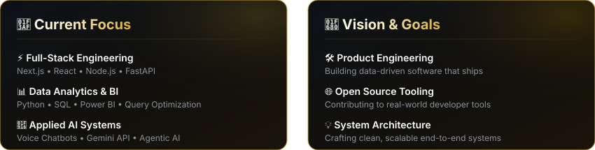
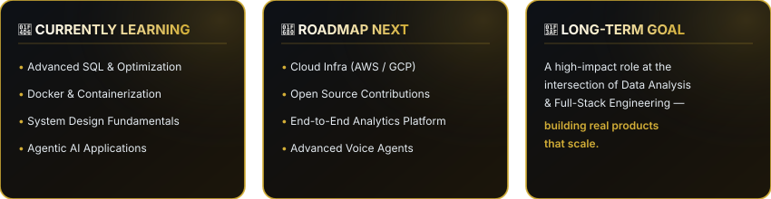

&nbsp;&nbsp;&nbsp;

 

> *"Building at the intersection of Data Analytics, Full-Stack Development, and AI — crafting clean, scalable systems that ship."*

## About Me

 

## 🛠️ Tech Stack & Skills

Systematically organized by domain

 

### 💻 Languages
       

 

### 🌐 Web Development & Frameworks
   

 

### 🗄️ Databases & Big Data
       

 

### ☁️ Cloud, DevOps, Analytics & Tools
       

## Featured Projects

Pulled live from pinned repositories

<table width="100%">
<tr>
<td width="50%" valign="top">

   
 
 

</td>
<td width="50%" valign="top">

   
 
 

</td>
</tr>
<tr>
<td width="50%" valign="top">

   
 

</td>
<td width="50%" valign="top">

  
 

</td>
</tr>
<tr>
<td width="50%" valign="top">

 
 

</td>
<td width="50%" valign="top">

 
 

</td>
</tr>
</table>

## 📊 GitHub Statistics & Analytics

Live, auto-updating metrics & contribution activity

 

<table width="100%">
<tr>
<td width="50%" align="center" valign="top">

  

</td>
<td width="50%" align="center" valign="top">

</td>
</tr>
</table>

 

<table width="100%">
<tr>
<td width="50%" align="center" valign="top">

  

</td>
<td width="50%" align="center" valign="top">
  
</td>
</tr>
</table>

  

  

## 🏆 Achievements & GitHub Badges -

 

   

  

## 🌟 Highlights

 

• 🚀 **End-to-End Delivery** — Actively building &amp; shipping full-stack data, backend, and AI applications  
• 🛠️ **Production-Ready Systems** — Public work spans complete working APIs, dashboards, and voice interfaces  
• 🤖 **Applied AI Innovation** — Continuously extending developer skills into agentic AI &amp; intelligent tooling  

## 🗺️ Learning Journey

 

## 🤝 Let's Connect

 

Thanks for stopping by.
 

